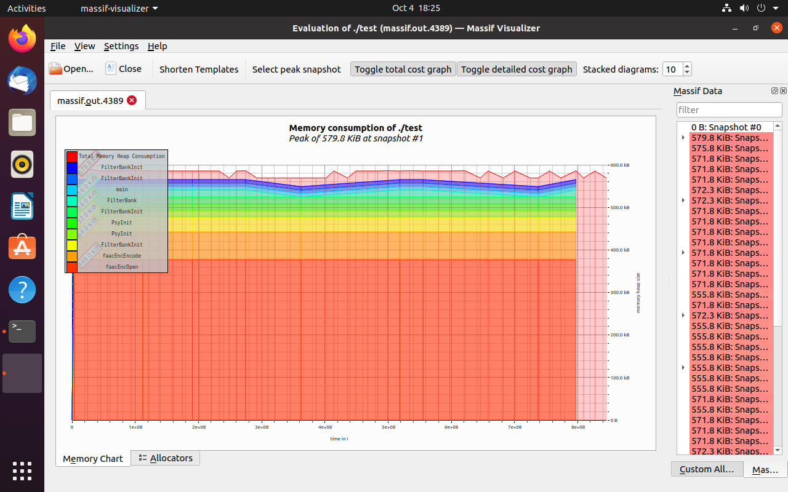
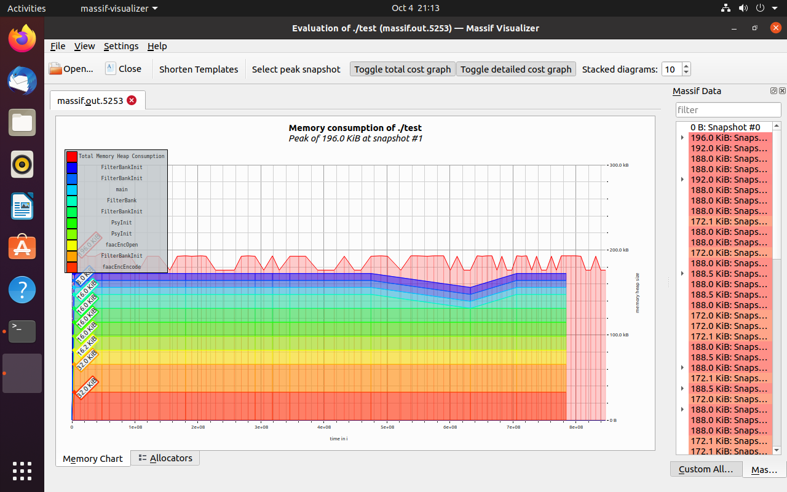

# 说明
faac内存开销较大，为方便嵌入式设备使用进行优化，在github上提了issues但是没人理我，所以就搞一份代码自己玩吧。
基于faac_1_30版本，原工程 https://github.com/knik0/faac

# 文件说明
* faac-1_30.zip 为 faac 源码
* 为了方便我个人使用，删除了 faac 源码中我用不到的文件，只保留 libfaac 目录下的必要文件和 inlcude 目录
* 增加 CMakeLists.txt 编译脚本

# 内存优化的内容
内存优化测试文件的格式为 PCM int16 小端 双声道 44100Hz

## 1.1 优化前
使用 valgrind 检查内存，结果如下，可以看到默认配置的内存开销约为 11.5 MB


## 1.2 修改默认最大声道数
修改 libfaac\coder.h
一般来说，双声道就够用了，如果有5.1声道之类的特殊需求可以自行修改

修改前
`#define MAX_CHANNELS 64`
修改后
`#define MAX_CHANNELS 2`

内存统计如下，约 560 KB


## 1.3 删除 bwpInfo
修改 libfaac\coder.h
在 faacEncOpen() 中会创建 faacEncStruct* hEncoder; 这个句柄
在 faacEncStruct.coderInfo 中的 bwpInfo 代码中没有用到，不知道作者为什么没有删除，意义不明。

修改前
`BwpInfo bwpInfo;`
修改后
`// BwpInfo bwpInfo;`

内存统计如下，约 240 KB


## 1.4 删除无效代码
修改 libfaac\frame.c
faacEncEncode() 的代码中有这样一段
```
hEncoder->sampleBuff[channel]		= hEncoder->nextSampleBuff[channel];
hEncoder->nextSampleBuff[channel]	= hEncoder->next2SampleBuff[channel];
hEncoder->next2SampleBuff[channel]	= hEncoder->next3SampleBuff[channel];
hEncoder->next3SampleBuff[channel]	= tmp;
```
申请了4个sampleBuff，这个函数每调用一次会依次交换这4个buffer，实际代码中只用到了 sampleBuff 和 next3SampleBuff，不明白作者为什么这样写，也可能是忘了删，这里可以修改为
```
hEncoder->sampleBuff[channel]		= hEncoder->next3SampleBuff[channel];
hEncoder->next3SampleBuff[channel]	= tmp;
```

以下几处记得也要一起修改

faacEncOpen() 中修改为
```
// hEncoder->nextSampleBuff[channel] = NULL;
// hEncoder->next2SampleBuff[channel] = NULL;
```

faacEncClose() 中修改为
```
// if (hEncoder->nextSampleBuff[channel])
//   FreeMemory(hEncoder->nextSampleBuff[channel]);
// if (hEncoder->next2SampleBuff[channel])
//   FreeMemory (hEncoder->next2SampleBuff[channel]);
```

faacEncStruct 中修改为
```
// double *nextSampleBuff[MAX_CHANNELS];
// double *next2SampleBuff[MAX_CHANNELS];
```

这样每声道可以节约 16KB 内存

内存统计如下，约 210 KB


## 1.5 优化数据结构
修改 libfaac\coder.h
这有个前提条件，就是不启用 DRM，这个宏在 libfaac\coder.h，默认就是关闭的
```//#define DRM```

接下来再看代码，CoderInfo 中有这样一个成员
```
struct {
    int data;
    int len;
} s[DATASIZE];
```
它用来进行哈夫曼编码，查看源码可知，这个结构体只在 huffcode() 函数中赋值，里面的数据来自于哈夫曼编码表，使用的码表为 book01 到 book11，没有用到book12，这11个码表的成员原型如下
```
typedef struct {
    const uint16_t len;
    const uint16_t data;
} hcode16_t;
```
因此可以把int改成short，每声道可以节约6KB内存

内存统计如下，约 200 KB


## 1.6 禁用 TNS
修改 libfaac\coder.h libfaac\bitstream.c
这个修改会影响音质，实测影响很小，音质上的差异要仔细听才能察觉，个人认为这一点音质上的损失完全可以接受。
把 CoderInfo.tnsInfo 成员也去掉，并删除 faacEncEncode() 中 TnsEncode() 的调用以及两处 TnsInit() 调用。
删除 faacEncConfiguration 中的 unsigned int useTns
编译时删除 tns.c
直接将 WriteTNSData() 函数修改如下
```
static int WriteTNSData(CoderInfo *coderInfo,
                        BitStream *bitStream,
                        int writeFlag)
{
    int bits = 0;

#ifndef DRM
    if (writeFlag) {
        PutBit(bitStream, 0, LEN_TNS_PRES);
    }
    bits += LEN_TNS_PRES;
#endif

    return bits;
}
```

内存统计如下，约 170 KB


## 1.7 修改数据类型
修改所有文件的 double 为 float
理论上来说这个修改会影响音质，实测没听出来，个人认为这个修改应该没问题
每声道内存再节省一半

内存统计如下，大约 90 KB


## 1.8 其他
以下无关紧要，能优化一点点，这里就不统计了
faacEncConfiguration 中 int channel_map[64]; 可以改为 int channel_map[MAX_CHANNELS];
faacEncStruct 去掉 double *msSpectrum[MAX_CHANNELS];

# 优化总结
除去 main() 函数中申请的buffer，经过以上优化已经可以做到单声道约 70 KB，双声道约 90 KB，这样的内存开销即使放到stm32的部分中高端型号上都能运行，还要啥自行车？

单声道内存统计如下，大约 70 KB


大家如果有更好的优化方法欢迎留言分享

# 其他问题
Q: windows编译报错 #include "win32_ver.h"
A: 这个文件是由configure生成的，目前看似乎没有太大影响，先去掉
